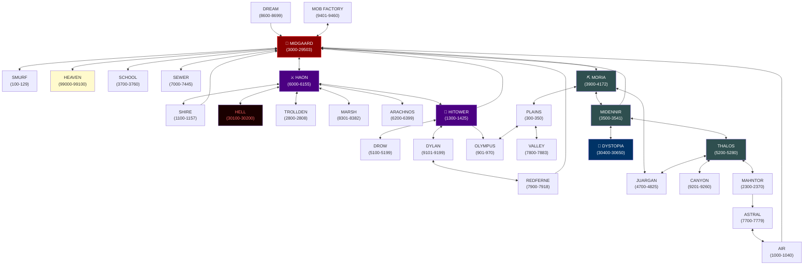

# Dystopia MUD — Zone Map

Connections between all zones. Arrows show traversable exits; `<-->` means bidirectional, `-->` means one-way.

## Zone Clusters

| Cluster | Hub | Members |
|---------|-----|---------|
| Haon | HAON | Shire, Hell, Trollden, Marsh, Arachnos, Hitower |
| Hitower branches | HITOWER | Drow, Dylan ↔ Redferne, Olympus |
| Moria | MORIA | Plains ↔ Valley, Juargan, Midennir |
| Thalos | THALOS (via Midennir) | Canyon, Juargan (shared), Mahntor |
| Astral chain | — | Mahntor → Astral → Air → Midgaard (one-way loop) |
| Direct to Midgaard | — | Smurf, Heaven, School, Sewer, Dream, Mob Factory |

## Notes

- **Juargan** connects to both Moria and Thalos — it's a crossroads zone.
- **Canyon**, **Hell**, and **Heaven** are dead-ends (single connection each).
- **Dystopia** (the main city zone) connects only via Midennir, not directly to Midgaard.
- The Astral chain (Mahntor → Astral → Air → Midgaard) is a long one-way loop back to the hub.
- Midgaard's VNUM range (3000–29503) is large; Moria, Midennir, and Thalos have VNUMs that fall within it but are separate area files.
- Many areas (arena, limbo, quest, and others) are isolated with no cross-zone exits.
